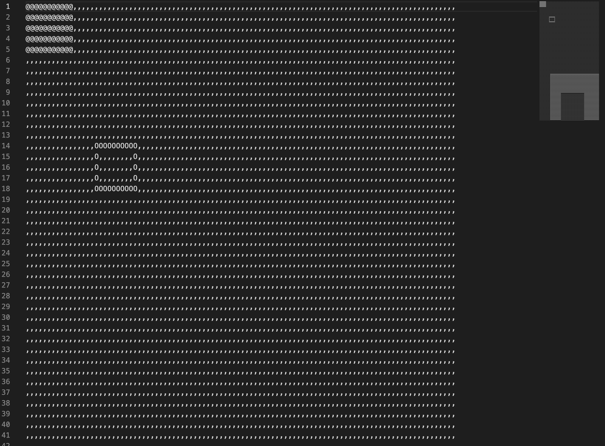

# EXAM RANK 03

This program draws filled and unfilled rectangles to the console

## How to build and run

    $> gcc main.c
    $> ./a.out <maps file>

## How to check

We must run our program and then run program from ecole42

    $> gcc main.c
    $> ./a.out <maps file> > res1
    $> gcc our_mini_paint.c
    $> ./a.out <maps file> > res2
    $> diff -s res1 res2

If program work correctly we must see:

    $> Files res1 and res2 are identical

## Allowed function

- fopen
- fread
- fscanf
- fclose
- write
- malloc
- calloc
- realloc
- free
- memset
- powf
- sqrtf

## Screnshots

​